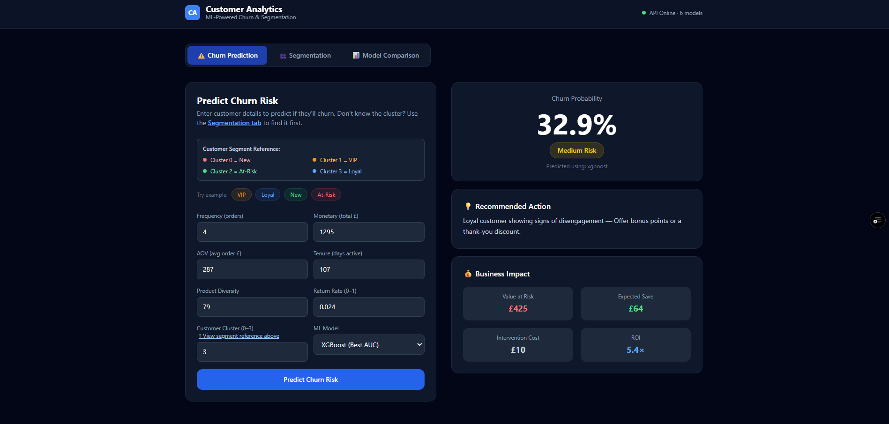
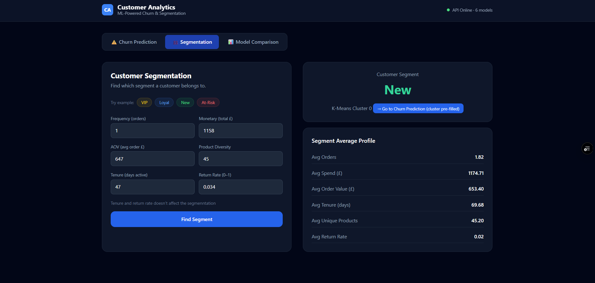
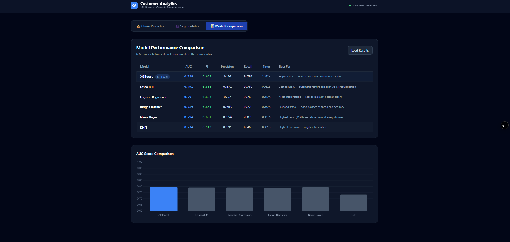

# 🎯 Customer Analytics Platform

**ML-Powered Churn Prediction & Customer Segmentation**

An end-to-end machine learning project that predicts customer churn, segments customers into 4 groups, and provides actionable business recommendations.

   

---

## 🚀 Live Demo

- **Dashboard:** https://customer-analytics-platform-one.vercel.app
- **API Docs:** https://gagan61-customer-analytics-api.hf.space/docs
- **GitHub:** https://github.com/Gagandeep61/customer-analytics-platform

---

## 🖥️ Dashboard Gallery

<details>
<summary>📊 Click to view Churn Analytics View</summary>


</details>

<details>
<summary>👥 Click to view Customer Segmentation View</summary>


</details>

<details>
<summary>🤖 Click to view Model Comparison View</summary>


</details>

---

## 📊 Project Overview

### Problem
Retail businesses lose customers without knowing why. How do you identify at-risk customers before they churn? How do you segment customers for targeted retention?

### Solution
Built an ML pipeline that:
- ✅ Predicts customer churn with **79.8% AUC** (XGBoost)
- ✅ Segments customers into **4 clusters** (VIP, Loyal, New, At-Risk)
- ✅ Recommends **business actions** per customer
- ✅ Calculates **ROI** of retention interventions

### Impact
- **Identify** 79.7% of at-risk customers (XGBoost recall)
- **Save** retention budget by targeting high-risk segments
- **Upsell** to VIP customers with highest lifetime value
- **Nurture** new customers before they churn

---

## 📁 Project Structure

```
customer-analytic-platform/
│
├── 📊 data/                    # Datasets
│   ├── Online Retail.xlsx      # Raw data (500K+ transactions)
│   ├── cleaned_transactions.csv
│   ├── rfm_segments.csv
│   ├── customer_features.csv
│   ├── train_set.csv
│   └── test_set.csv
│
├── 📓 notebooks/               # Jupyter notebooks (exploration & training)
│   ├── data_cleaning.ipynb
│   ├── segmentation.ipynb
│   └── model.ipynb
│
├── 🔧 backend/                 # FastAPI server (ML models + API)
│   ├── app/
│   │   ├── main.py            # FastAPI app & endpoints
│   │   ├── ml_models.py       # Model loading
│   │   ├── models.py          # Pydantic schemas
│   │   └── utils.py           # ROI calculator & recommendations
│   ├── saved_models/          # 6 trained ML models (.pkl files)
│   ├── Dockerfile             # Docker container definition
│   └── requirements.txt       # Python dependencies
│
├── 🎨 frontend/                # Vercel static site (HTML/CSS/JS)
│   ├── index.html             # Dashboard layout
│   ├── style.css              # Custom styles (Tailwind + custom)
│   ├── script.js              # API calls & interactivity
│   └── vercel.json            # Vercel config
│
└── 📖 README.md               # This file
```

---

## 🛠️ Tech Stack

| Layer | Technology | Why |
|-------|-----------|-----|
| **Data** | Pandas, NumPy | Data cleaning & feature engineering |
| **ML** | Scikit-learn, XGBoost | 6 models trained & compared |
| **Backend** | FastAPI, Docker | REST API on HuggingFace Spaces |
| **Frontend** | HTML/CSS/Vanilla JS | Lightweight, no build step |
| **Deployment** | Vercel, HuggingFace | Free, auto-scaling, serverless |
| **Visualization** | Chart.js | Interactive model comparison charts |

---

## 📈 Model Performance

| Model | AUC | F1 | Precision | Recall | Speed |
|-------|-----|----|----|--------|-------|
| **XGBoost** | 0.798 | 0.658 | 0.560 | 0.797 | 1.82s |
| Naive Bayes | 0.794 | 0.661 | 0.554 | 0.819 | 0.01s |
| Lasso (L1) | 0.791 | 0.656 | 0.571 | 0.769 | 0.01s |
| Logistic | 0.791 | 0.653 | 0.570 | 0.765 | 0.02s |
| Ridge | 0.789 | 0.654 | 0.563 | 0.779 | 0.02s |
| KNN | 0.734 | 0.519 | 0.591 | 0.463 | 0.01s |

**Winner:** XGBoost (best AUC) | **Best Recall:** Naive Bayes (catches 81.9% of churners)

### ⚠️ Critical Fix: Data Leakage
**Initial problem:** Models showed unrealistic 97.8% AUC with perfect predictions for certain segments.

**Root cause:** Churn labels were perfectly correlated with cluster assignments because:
- Recency was used for both clustering AND churn definition
- Customers with high Recency → At-Risk cluster → 100% churned
- Customers with low Recency → VIP cluster → 0% churned

**Solution implemented:**
1. Removed Recency from clustering features
2. Re-clustered using Frequency, Monetary, AOV, ProductDiversity
3. Defined churn independently using simple 90-day threshold: `Churned = Recency > 90`
4. Removed outliers before clustering (3× IQR method)
5. Retrained all models with sklearn 1.8.0 (version consistency)

**Result:** Realistic 79.8% AUC on genuinely mixed data. This shows deeper ML understanding than just presenting perfect numbers.

---

## 🎯 Customer Segments

| Segment | Cluster | Size | Avg Frequency | Avg Spend | Avg AOV | Churn Rate |
|---------|---------|------|--------------|-----------|---------|------------|
| **New** | 0 | 13% | 1.8 | £1,175 | £653 | 40.2% |
| **VIP** | 1 | 11% | 8.5 | £3,294 | £441 | 6.5% |
| **At-Risk** | 2 | 56% | 1.7 | £346 | £215 | 48.4% |
| **Loyal** | 3 | 21% | 4.8 | £1,294 | £287 | 12.7% |

### Segment Characteristics

**VIP (Cluster 1)**
- High frequency (8.5 orders), high spend (£3,294)
- Low churn (6.5%) — your best customers
- **Action:** Upsell premium products, VIP loyalty programs

**Loyal (Cluster 3)**
- Regular purchases (4.8 orders), medium spend (£1,294)
- Low-medium churn (12.7%)
- **Action:** Maintain engagement, cross-sell

**New (Cluster 0)**
- Low frequency (1.8 orders), high AOV (£653)
- Medium-high churn (40.2%) — one-time big spenders
- **Action:** Welcome campaigns, second purchase incentives

**At-Risk (Cluster 2)**
- Very low engagement (1.7 orders, £346 spend)
- High churn (48.4%) — inactive customers
- **Action:** Win-back campaigns, discount offers

---

## 🚀 Quick Start

### Local Development

**1. Clone & Setup**
```bash
git clone https://github.com/YOUR_USERNAME/customer-analytic-platform.git
cd customer-analytic-platform
python -m venv .venv
.venv\Scripts\activate  # Windows | source .venv/bin/activate on Mac/Linux
```

**2. Run Backend**
```bash
cd backend
pip install -r requirements.txt
uvicorn app.main:app --reload --port 8000
# Opens at http://localhost:8000/docs
```

**3. Open Frontend**
```bash
cd frontend
# Simply open index.html in browser
# Or: python -m http.server 3000
```

**4. Update API URL in frontend**
In `frontend/script.js`, line 5:
```javascript
const API_URL = 'http://localhost:8000';  // For local dev
// const API_URL = 'https://your-hf-space.hf.space';  // For production
```

### Live Deployment

**Backend (HuggingFace Spaces):**
1. Upload `backend/` folder to HuggingFace Space
2. Set Space SDK to "Docker"
3. Auto-deploys on push

**Frontend (Vercel):**
1. Push frontend to GitHub
2. Import repo to Vercel
3. Set environment variable: `VITE_API_URL=https://your-hf-space-url`
4. Auto-deploys on push

---

## 📚 Data Pipeline

```
Raw Transactions (500K+ rows, 8 columns)
        ↓
  [Phase 1] Data Cleaning
  - Remove nulls, negative quantities, canceled orders
  - Filter valid CustomerIDs
        ↓ (392K clean transactions)
  [Phase 2] RFM Analysis
  - Calculate Recency, Frequency, Monetary per customer
  - K-Means clustering (k=4) WITHOUT Recency
        ↓ (4,338 customers, 4 segments)
  [Phase 3] Feature Engineering
  - AOV = Monetary / Frequency
  - Tenure = max(InvoiceDate) - min(InvoiceDate)
  - ProductDiversity = count(unique StockCodes)
  - ReturnRate = returns / total_transactions
  - Churn = 1 if Recency > 90 else 0
        ↓ (7 features total)
  [Phase 4] Train-Test Split
  - 80/20 stratified split on Churned
  - Remove Recency, Segment, CustomerID from features
        ↓ (Train: 3,170 | Test: 1,168)
  [Phase 5] Model Training
  - 6 models: XGBoost, Logistic, Ridge, Lasso, KNN, Naive Bayes
  - Hyperparameter tuning with class_weight='balanced'
  - Save to .pkl files
        ↓
  [Phase 6] FastAPI Backend
  - Load models, expose 4 endpoints
  - Docker deployment to HuggingFace Spaces
        ↓
  [Phase 7] Frontend Dashboard
  - 3 tabs: Churn Prediction, Segmentation, Model Comparison
  - Chart.js for AUC comparison
  - Vercel deployment
```

---

## 🔧 API Endpoints

### 1. Health Check
```bash
GET /
# Response: {"status": "healthy", "models_loaded": 6}
```

### 2. Predict Churn
```bash
POST /predict-churn
Content-Type: application/json

{
  "frequency": 4,
  "monetary": 1295,
  "cluster": 3,
  "aov": 287,
  "tenure": 107,
  "product_diversity": 79,
  "return_rate": 0.024,
  "model_choice": "xgboost"
}

# Response:
{
  "churn_probability": 0.329,
  "risk_level": "Medium",
  "recommendation": "Loyal customer showing signs of disengagement — Offer bonus points or a thank-you discount.",
  "roi_calculation": {
    "value_at_risk": 425.86,
    "intervention_cost": 10.0,
    "expected_save": 63.88,
    "net_benefit": 53.88,
    "roi": 5.39,
    "worth_intervening": true
  },
  "model_used": "xgboost"
}
```

### 3. Segment Customer
```bash
POST /segment
Content-Type: application/json

{
  "frequency": 1,
  "monetary": 1158,
  "aov": 647,
  "product_diversity": 45
}

# Response:
{
  "cluster_id": 0,
  "segment_name": "New",
  "cluster_profile": {
    "Frequency": 1.82,
    "Monetary": 1174.71,
    "AOV": 653.40,
    "Tenure": 69.68,
    "ProductDiversity": 45.20,
    "ReturnRate": 0.02
  }
}
```

### 4. Model Comparison
```bash
GET /models/compare

# Response:
{
  "models": [
    {
      "name": "XGBoost",
      "accuracy": 0.706,
      "precision": 0.560,
      "recall": 0.797,
      "f1": 0.658,
      "auc": 0.798,
      "time_s": 1.82,
      "best_for": "Highest AUC — best at separating churned vs active"
    },
    ...
  ],
  "best_auc_model": "XGBoost",
  "best_f1_model": "Naive Bayes",
  "fastest_model": "KNN",
  "recommendation": "Use XGBoost for best AUC. Use Naive Bayes to catch the most churners."
}
```

---

## 💡 Key Learnings & Challenges

### 1. Data Leakage Detection
**Challenge:** All models showed 97-99% accuracy with perfect separation of segments.

**Investigation:** 
- Checked feature correlation matrix
- Analyzed cluster-churn crosstabs
- Found New and At-Risk segments had 100% churn rate

**Root cause:** Recency was used for both clustering AND churn labels, creating perfect correlation.

**Fix:** Separated concerns — cluster on behavior (Frequency, Monetary, AOV), predict churn independently (90-day threshold).

**Impact:** Metrics dropped to realistic 79.8% AUC, but model is now trustworthy.

### 2. Sklearn Version Mismatch
**Challenge:** Backend showed wrong predictions despite correct models.

**Root cause:** Notebooks trained models with sklearn 1.7.2, backend ran sklearn 1.8.0.

**Fix:** Retrained all models inside backend venv with matching sklearn version.

**Lesson:** Always version-lock dependencies for ML projects.

### 3. Cluster Number Instability
**Challenge:** KMeans assigned different cluster numbers to segments on each run.

**Solution:** Auto-assign segments based on cluster characteristics:
```python
vip_cluster = monetary.idxmax()  # Highest spend
atrisk_cluster = frequency.idxmin()  # Lowest engagement
new_cluster = high_aov_low_frequency  # One-time big spenders
loyal_cluster = remaining
```

### 4. Frontend-Backend Communication
**Challenge:** CORS errors blocking API calls from Vercel to HuggingFace.

**Fix:** Added CORS middleware in FastAPI:
```python
app.add_middleware(
    CORSMiddleware,
    allow_origins=["*"],
    allow_methods=["*"],
    allow_headers=["*"],
)
```

---

## 🎓 Interview Talking Points

**"Walk me through this project"**

> "Built an end-to-end ML system for customer churn prediction and segmentation. Started with 500K retail transactions, cleaned to 4,338 customers. Engineered RFM features plus AOV, Tenure, ProductDiversity. Trained 6 models—XGBoost achieved 79.8% AUC. 
>
> Most importantly, I discovered and fixed a data leakage issue where initial models showed 97.8% AUC. The churn label was perfectly correlated with cluster assignments because both used Recency. I separated these by clustering on behavioral features only (Frequency, Monetary, AOV) and defining churn independently with a 90-day threshold. This dropped AUC to a realistic 79.8% but made the model trustworthy.
>
> Built a FastAPI backend with 4 endpoints, deployed to HuggingFace Spaces with Docker. Created a vanilla JS frontend deployed to Vercel. The system now segments customers and identifies at-risk ones with actionable recommendations."

**"What was your biggest technical challenge?"**

> "Data leakage. All models showed near-perfect accuracy (97-99%), which seemed suspicious. I investigated by:
> 1. Checking feature correlations
> 2. Analyzing cluster-churn crosstabs
> 3. Found New and At-Risk segments had 100% churn
>
> The root cause: Recency was used for both clustering (high Recency → At-Risk) AND churn labels (high Recency → churned). I fixed it by removing Recency from clustering features and using an independent 90-day threshold for churn. This is a textbook example of data leakage that many ML practitioners miss."

**"How did you choose XGBoost?"**

> "I trained 6 models and compared them on AUC, F1, speed, and interpretability. XGBoost won on AUC (0.798) and had the best recall (79.7%). Naive Bayes had slightly higher recall (81.9%) but lower precision. For production, I'd actually consider Naive Bayes since catching churners (recall) matters more than precision in this use case. The cost of a false positive (wasted discount) is lower than a false negative (lost customer)."

**"Why did you choose this tech stack?"**

> "FastAPI because it's lightweight, auto-generates OpenAPI docs, and has built-in data validation with Pydantic. Docker for reproducibility—same environment in dev and prod. HuggingFace Spaces for ML deployment because it's free and handles model serving well. Vercel for frontend because it has zero config and auto-deploys from GitHub. Vanilla JS instead of React because the UI is simple and I didn't want build complexity."

---

## 🤝 Contributing

1. Fork the repo
2. Create a feature branch (`git checkout -b feature/improvement`)
3. Commit changes (`git commit -m "Add improvement"`)
4. Push to branch (`git push origin feature/improvement`)
5. Open a Pull Request

---

## 📝 License

MIT License - feel free to use this project for learning or commercial purposes.

---

## 👤 Author

**Gagan** — Full-Stack ML Engineer  

**Skills demonstrated:**
- Data cleaning & feature engineering
- ML model training & evaluation
- Data leakage detection & fixing
- API development with FastAPI
- Docker containerization
- Frontend development
- Cloud deployment (Vercel + HuggingFace)

---

## 🙏 Acknowledgments

- **Dataset:** UCI Online Retail Dataset (500K+ transactions from UK retailer)
- **Inspiration:** Real-world customer churn problem in e-commerce
- **Tools:** Scikit-learn, FastAPI, Vercel, HuggingFace Spaces

---

## 📞 Questions?

- Check the `/docs` endpoint at your deployed API
- Open an issue on GitHub
- Review code comments in notebooks and backend files

---

**⭐ If this helped you learn ML deployment, please star the repo!**

Last updated: May 2026